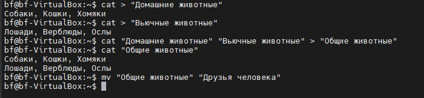
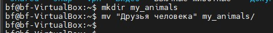

Итоговая контрольная работа по блоку специализации
===

1. Используя команду cat в терминале операционной системы Linux, создать
   два файла Домашние животные (заполнив файл собаками, кошками,
   хомяками) и Вьючные животными заполнив файл Лошадьми, верблюдами и
   ослы), а затем объединить их. Просмотреть содержимое созданного файла.
   Переименовать файл, дав ему новое имя (Друзья человека).

* __cat > "Домашние животные"
  Собаки, кошки, хомяки__
* __cat > "Вьючные животные"
  Лошади, верблюды, ослы__
* __cat "Домашние животные" "Вьючные животные" > "Общие животные"__
* __cat "Общие животные"__
* __mv "Общие животные" "Друзья человека"__

2. Создать директорию, переместить файл туда.
* __mkdir my_animals__
* __mv "Друзья человека" my_animals/__
  

